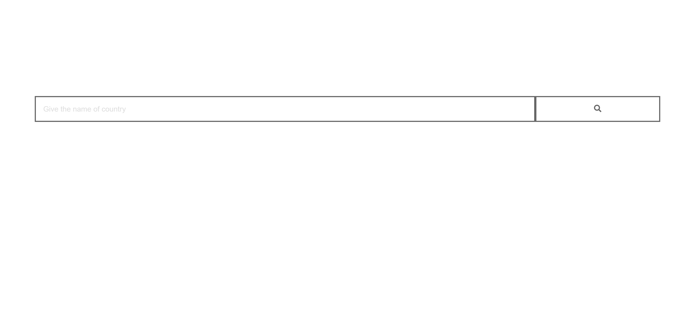
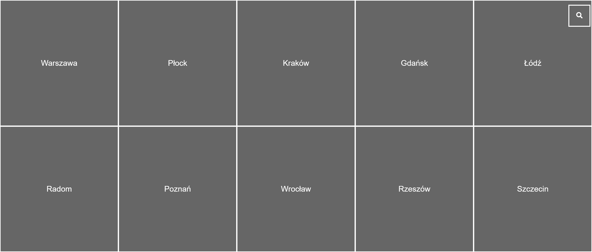
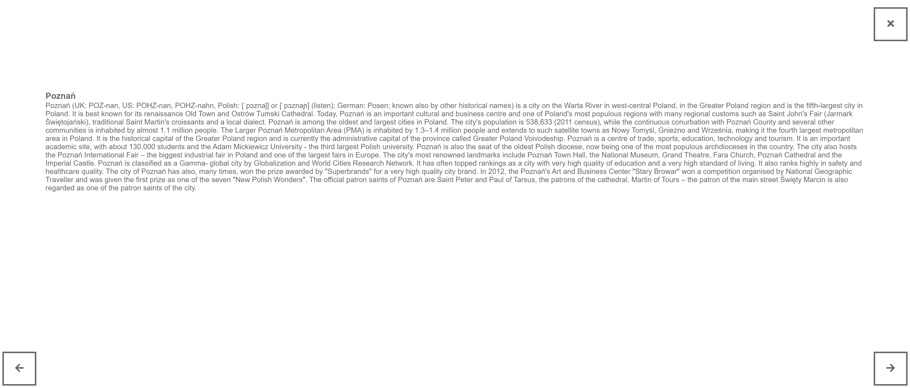

# Project Name
> 10 most polluted cities.

## Table of contents
* [General info](#general-info)
* [Screenshots](#screenshots)
* [Technologies](#technologies)
* [Setup](#setup)
* [Features](#features)
* [Status](#status)
* [Inspiration](#inspiration)
* [Contact](#contact)

## General info
The project was created as a response to the Front-end recruitment task.

## Screenshots

## Technologies
* HTML5
* CSS3
* JavaScript (ES6)

## Setup
Clone or download github repository:
`git clone https://github.com/filuus/10-most-polluted-cities.git`
and run the file 'index.html' in the browser.
Link to demo version:
http://filuuus.ayz.pl/cities/index.html

## Features
List of features:
* Displays the top 10 most polluted cities in the country
* Displays information about each city

To-do list:
* Color the tiles depending on the amount of dirt

## Status
Project is: _in progress_

## Inspiration
Thanks to 'Microsoft' for coming up with tiles :)

## Contact
Created by [@filuus](https://github.com/filuus) - feel free to contact me!
